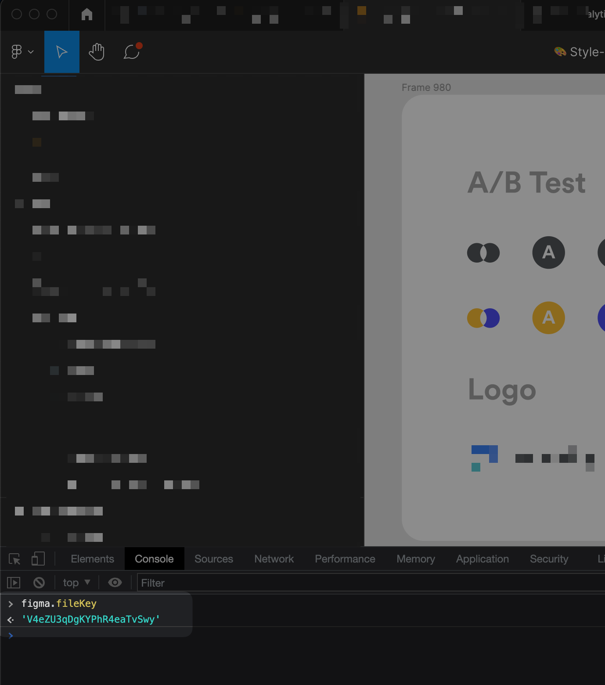

# Reserving Figma file-key and page name

1. Open the page that contains the icons
2. Open the Developer console (Cmd + Option + I / Ctrl + Shift + I)
3. Open the developer console
4. The file key will be available by writing `figma.fileKey`

5. The page name will be available by writing `figma.currentPage.name`

